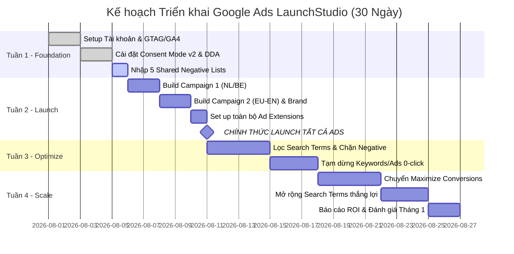

# 🎯 Google Ads Search Keywords — LaunchStudio.eu
## Bảng Từ khóa & Cấu trúc Campaign Song ngữ: 🇬🇧 English ⟷ 🇳🇱 Dutch

> **Nguồn dữ liệu**: Quét trực tiếp [launchstudio.eu](https://launchstudio.eu/) + [Google Ads Strategy Doc](https://docs.google.com/document/d/1Bky8AX1xyQcQCuvpKYkcuk5pqR0IGJXZpzInFCcLZRo/)  
> **Cập nhật**: Tháng 8/2026 · Chuẩn bị sẵn sàng import Google Ads Editor

---

## 📊 1. Business Context (Bối cảnh Doanh nghiệp)

| Yếu tố | 🇬🇧 English | 🇳🇱 Dutch | 🇻🇳 Chi tiết tiếng Việt |
|---|---|---|---|
| **Brand** | Launch Studio | Launch Studio | Thương hiệu Launch Studio |
| **Website URL** | `launchstudio.eu/en/` | `launchstudio.eu` | Website đa ngôn ngữ |
| **Location** | Netherlands (EU) | Nederland (EU) | Đặt trụ sở tại Hà Lan |
| **Target Audience** | AI-native founders (Lovable, Cursor, Bolt) needing production launch | AI-oprichters die prototype willen omzetten naar productie | Các founder build app bằng AI cần đưa lên chạy thực tế |
| **Core Service** | Prototype → Production: Security, Payments (Stripe), Auth, Database, Hosting | Prototype → Productie: Beveiliging, Betalingen (Stripe), Auth, Database, Hosting | Hoàn thiện Backend, Auth, DB, Stripe, Security & Hosting |
| **Product Scope** | Website, Webshop, SaaS, Mobile App, Dashboard, Internal Tool | Website, Webshop, SaaS, Mobiele App, Dashboard, Interne Tool | Website, SaaS, App, Dashboard, Công cụ nội bộ |
| **Pricing Model** | Fixed price €800 – €7,500 + €49/mo hosting | Vaste prijs €800 – €7.500 + €49/mnd hosting | Giá trọn gói cố định, không phát sinh chi phí theo giờ |
| **Key USP** | 11+ yrs engineering exp, fixed price, 100% code ownership, live in 1-3 weeks | 11+ jaar engineering ervaring, vaste prijs, 100% code eigendom, live in 1-3 weken | 11+ năm kinh nghiệm, sở hữu 100% code, live trong 1-3 tuần |
| **Enterprise Proof** | Vodafone, TNO, CFLW, Statler BI, Xpar Vision | Vodafone, TNO, CFLW, Statler BI, Xpar Vision | Khách hàng doanh nghiệp đã kiểm chứng uy tín |

---

## 🏗️ 2. Campaign Architecture (Cấu trúc Chiến dịch)

| Chiến dịch | Thị trường (Geo) | Ngôn ngữ | Ngân sách khởi điểm (Conservative) | Ngân sách mở rộng (Aggressive) | Bidding Strategy |
|---|---|---|---|---|---|
| **Campaign 1 (NL/BE)** | Hà Lan & Vùng Flanders (Bỉ) | 🇳🇱 Dutch | €1.500 / tháng | €3.000 / tháng | Maximize Clicks (CPC Cap €8) ➔ Maximize Conversions ➔ Target CPA |
| **Campaign 2 (EU-EN)** | DE, FR, ES, IT, SE, DK, PL, PT, IE | 🇬🇧 English | €1.500 / tháng | €3.000 / tháng | Maximize Clicks (CPC Cap €10) ➔ Maximize Conversions ➔ Target CPA |
| **Campaign 3 (Brand)** | Toàn bộ EU + NL/BE | 🇬🇧 EN + 🇳🇱 NL | €100 – €150 / tháng (€3-5/ngày) | €300 / tháng | Target Impression Share 95-100% |
| **Campaign 4 (PMax / Retargeting)**| Kết hợp NL/BE/EU | 🇬🇧 EN + 🇳🇱 NL | Dùng chung ngân sách | Remarketing khách truy cập | Tối đa hóa giá trị chuyển đổi |

---

## 🔑 3. Core Keywords Song ngữ theo từng Ad Group

---

### 🎯 Ad Group 1: General MVP Development (Xây dựng & Phát triển MVP)
> **Mục tiêu**: Nhắm vào các founder đang tìm kiếm dịch vụ dựng MVP trọn gói, nhanh chóng với giá cố định.

| # | 🇬🇧 English Keyword (EU/Global) | 🇳🇱 Dutch Keyword (NL/BE) | Match Type | Priority | 🇻🇳 Ý nghĩa / Search Intent |
|---|---|---|---|---|---|
| 01 | `MVP development fixed price` | `mvp ontwikkelen vaste prijs` | Exact `[...]` | 🔴 High | Phát triển MVP giá cố định |
| 02 | `hire MVP developer Europe` | `mvp laten bouwen` | Phrase `\"...\"` | 🔴 High | Thuê lập trình viên / agency làm MVP |
| 03 | `prototype to production service` | `applicatie laten bouwen` | Phrase `\"...\"` | 🔴 High | Dịch vụ đưa bản mẫu lên chạy thực tế |
| 04 | `fixed price MVP development` | `software prototype maken` | Phrase `\"...\"` | 🔴 High | Làm bản mẫu phần mềm giá cố định |
| 05 | `launch startup app fast` | `app prototype laten maken` | Phrase `\"...\"` | 🟡 Medium | Ra mắt app cho startup nhanh chóng |
| 06 | `affordable MVP developer` | `wat kost een mvp bouwen` | Phrase `\"...\"` | 🟡 Medium | Tìm kiếm chi phí / giá làm MVP rẻ |
| 07 | `build SaaS MVP` | `saas platform laten bouwen` | Phrase `\"...\"` | 🟡 Medium | Xây dựng nền tảng SaaS MVP |
| 08 | `startup MVP development agency` | `startup app laten ontwikkelen` | Phrase `\"...\"` | 🟡 Medium | Agency phát triển MVP cho startup |

---

### 🎯 Ad Group 2: AI Tool Code Fix (Sửa & Hoàn thiện Code từ AI Tools)
> **Mục tiêu**: Nhắm vào các founder đã dùng Lovable, Cursor, Bolt.new nhưng bị kẹt lỗi backend, database, deployment.

| # | 🇬🇧 English Keyword (EU/Global) | 🇳🇱 Dutch Keyword (NL/BE) | Match Type | Priority | 🇻🇳 Ý nghĩa / Search Intent |
|---|---|---|---|---|---|
| 01 | `Lovable app developer` | `Lovable.dev developer` | Phrase `\"...\"` | 🔴 High | Tìm lập trình viên chuyên sửa app Lovable |
| 02 | `Cursor AI app developer` | `Cursor AI developer` | Phrase `\"...\"` | 🔴 High | Tìm lập trình viên chuyên sửa code Cursor |
| 03 | `make AI prototype production ready`| `AI prototype launch ready maken`| Phrase `\"...\"` | 🔴 High | Đưa bản mẫu AI lên chuẩn chạy thực tế |
| 04 | `Bolt.new app scaling` | `Bolt.new app opschalen` | Phrase `\"...\"` | 🟡 Medium | Mở rộng quy mô ứng dụng Bolt.new |
| 05 | `connect database to Lovable app` | `Lovable app database koppelen` | Phrase `\"...\"` | 🟡 Medium | Kết nối cơ sở dữ liệu vào app Lovable |
| 06 | `deploy AI app to production` | `AI app live zetten` | Phrase `\"...\"` | 🟡 Medium | Triển khai / đưa app AI lên môi trường live |
| 07 | `vibe coding to production` | `vibe coding naar productie` | Phrase `\"...\"` | 🔴 High | Trend 2026: Đưa code Vibe Coding ra thị trường |
| 08 | `fix AI generated code` | `ai gegenereerde code laten fixen` | Phrase `\"...\"` | 🔴 High | Sửa lỗi code do AI tự động sinh ra |
| 09 | `Cursor project to production` | `Cursor project afmaken` | Phrase `\"...\"` | 🟡 Medium | Hoàn thiện dự án Cursor để chạy thực tế |
| 10 | `Bolt.new deploy to production` | `Bolt.new project live zetten` | Phrase `\"...\"` | 🟡 Medium | Deploy dự án Bolt.new lên server thật |

---

### 🎯 Ad Group 3: Integration Problems (Tích hợp Stripe, Auth & Database)
> **Mục tiêu**: Nhắm vào các lỗi kỹ thuật cụ thể: Webhook Stripe không nhận, Supabase Auth lỗi, bảo mật Database.

| # | 🇬🇧 English Keyword (EU/Global) | 🇳🇱 Dutch Keyword (NL/BE) | Match Type | Priority | 🇻🇳 Ý nghĩa / Search Intent |
|---|---|---|---|---|---|
| 01 | `Stripe integration developer` | `Stripe webhook developer` | Phrase `\"...\"` | 🔴 High | Thuê lập trình viên tích hợp Stripe / Webhooks |
| 02 | `Stripe webhook not working production`| `Stripe webhook werkt niet in productie`| Phrase `\"...\"` | 🟡 Medium | Lỗi webhook Stripe không chạy trên production |
| 03 | `Supabase auth setup service` | `Supabase auth instellen` | Phrase `\"...\"` | 🟡 Medium | Cài đặt và cấu hình xác thực Supabase Auth |
| 04 | `Supabase database setup service` | `Supabase database setup` | Phrase `\"...\"` | 🟡 Medium | Thiết lập cơ sở dữ liệu Supabase & RLS |
| 05 | `deploy web app with payments` | `Stripe koppeling website` | Phrase `\"...\"` | 🟡 Medium | Triển khai web app có cổng thanh toán |
| 06 | `web app security audit startup` | `ai prototype beveiliging` | Phrase `\"...\"` | 🟡 Medium | Kiểm toán an ninh & bảo mật cho app AI |
| 07 | `web app hosting and management` | `webapplicatie hosting en beheer` | Phrase `\"...\"` | 🟡 Medium | Dịch vụ hosting & quản trị web app |
| 08 | `Lovable to Vercel deployment` | `Lovable naar Vercel deployen` | Phrase `\"...\"` | 🟡 Medium | Triển khai app Lovable lên Vercel / Railway |

---

### 🎯 Ad Group 4: Competitor / Alternative (So sánh & Thay thế Agency/No-Code)
> **Mục tiêu**: Nhắm vào khách hàng thấy Agency truyền thống quá đắt (€50k+) hoặc bị giới hạn bởi No-Code (Bubble.io).

| # | 🇬🇧 English Keyword (EU/Global) | 🇳🇱 Dutch Keyword (NL/BE) | Match Type | Priority | 🇻🇳 Ý nghĩa / Search Intent |
|---|---|---|---|---|---|
| 01 | `custom software development fixed price`| `software laten bouwen vaste prijs`| Phrase `\"...\"` | 🔴 High | Phát triển phần mềm theo yêu cầu giá cố định |
| 02 | `affordable software agency` | `goedkoop softwarebureau` | Phrase `\"...\"` | 🟡 Medium | Tìm kiếm agency phần mềm giá hợp lý / tiết kiệm |
| 03 | `no-code agency alternative` | `no-code bureau alternatief` | Phrase `\"...\"` | 🟡 Medium | Giải pháp thay thế các agency no-code |
| 04 | `software agency alternative` | `software bureau alternatief` | Phrase `\"...\"` | 🟡 Medium | Giải pháp thay thế agency truyền thống đắt đỏ |
| 05 | `Bubble.io alternative` | `Bubble.io alternatief` | Phrase `\"...\"` | 🟡 Medium | Tìm kiếm giải pháp code thật thay thế Bubble |
| 06 | `alternative to expensive dev agency` | `betaalbaar software bureau nederland` | Phrase `\"...\"` | 🟡 Medium | Agency phần mềm giá tốt tại Hà Lan / Châu Âu |
| 07 | `no-code to real code migration` | `no-code naar echte code migratie` | Phrase `\"...\"` | 🟡 Medium | Chuyển đổi từ No-Code sang Code thật 100% |
| 08 | `fixed price web development Europe` | `webshop laten bouwen vaste prijs` | Phrase `\"...\"` | 🟡 Medium | Làm web / webshop trọn gói giá cố định |

---

## 🏷️ 4. Brand Keywords (Chiến dịch Bảo vệ Thương hiệu)

| # | 🇬🇧 English Keyword | 🇳🇱 Dutch Keyword | Match Type | Priority | 🇻🇳 Mục đích |
|---|---|---|---|---|---|
| 01 | `Launch Studio` | `Launch Studio` | Phrase / Exact | 🔴 High | Tìm kiếm tên thương hiệu chính xác |
| 02 | `LaunchStudio.eu` | `LaunchStudio.eu` | Phrase / Exact | 🔴 High | Tìm kiếm tên miền website |
| 03 | `Launch Studio MVP` | `Launch Studio MVP` | Phrase | 🔴 High | Tìm kiếm dịch vụ MVP của Launch Studio |
| 04 | `Launch Studio AI` | `Launch Studio AI` | Phrase | 🔴 High | Tìm kiếm giải pháp AI của Launch Studio |

---

## 🚫 5. Negative Keywords Song ngữ (Từ khóa phủ định 5 danh sách)

> Áp dụng dạng **Shared Negative List** cho toàn bộ các chiến dịch để chặn 100% lưu lượng rác không mang lại doanh thu.

| Danh sách phủ định | 🇬🇧 English Negative Keywords | 🇳🇱 Dutch Negative Keywords | 🇻🇳 Lý do loại trừ |
|---|---|---|---|
| **1. Informational (Hỏi đáp, tự học)** | `-free`, `-tutorial`, `-course`, `-how to`, `-what is`, `-learn`, `-youtube`, `-video`, `-blog`, `-guide` | `-gratis`, `-handleiding`, `-cursus`, `-hoe gebruik je`, `-wat is`, `-leren`, `-uitleg`, `-voorbeeld` | Người dùng chỉ tìm tài liệu học tập, không có ý định thuê làm dịch vụ |
| **2. Job Seekers (Tìm việc, tuyển dụng)**| `-job`, `-jobs`, `-vacancy`, `-salary`, `-hiring`, `-internship`, `-career`, `-resume`, `-recruiter` | `-vacature`, `-vacatures`, `-baan`, `-salaris`, `-stage`, `-stagiair`, `-carrière`, `-werkervaring` | Lập trình viên tìm việc làm, tránh tốn tiền click tuyển dụng |
| **3. Enterprise & CMS không liên quan** | `-enterprise`, `-SAP`, `-Oracle`, `-Salesforce`, `-WordPress theme`, `-Wix`, `-Squarespace`, `-template` | `-enterprise`, `-SAP`, `-Oracle`, `-Salesforce`, `-WordPress thema`, `-Wix`, `-Squarespace`, `-sjabloon` | Khách hàng tìm CMS kéo thả giá rẻ hoặc hệ thống ERP siêu lớn |
| **4. Tool Downloads (Tải phần mềm)** | `-download`, `-install`, `-crack`, `-torrent`, `-keygen`, `-license key`, `-Cursor download` | `-downloaden`, `-installeren`, `-gratis downloaden`, `-Cursor AI downloaden`, `-Lovable gratis` | Người dùng tìm link tải app Cursor / tool AI miễn phí |
| **5. DIY & No-Code Platforms** | `-build yourself`, `-DIY`, `-make your own`, `-Flutterflow tutorial`, `-Adalo tutorial` | `-zelf bouwen`, `-doe het zelf`, `-zelf maken`, `-gratis app maken` | Người dùng muốn tự mày mò tự làm, không muốn thuê dịch vụ |

---

## 🔗 6. Ad Extensions Song ngữ (Tiện ích mở rộng quảng cáo)

### 📌 Sitelinks Extensions (Liên kết trang web con)
| # | 🇬🇧 English Sitelink | 🇳🇱 Dutch Sitelink | URL đích | 🇻🇳 Giải nghĩa |
|---|---|---|---|---|
| **1** | `View Packages` | `Bekijk Pakketten` | `https://launchstudio.eu/#packages` | Xem bảng giá và các gói dịch vụ |
| **2** | `Calculate Your Price` | `Bereken Je Prijs` | `https://launchstudio.eu/#calculator` | Công cụ tính toán chi phí dự án |
| **3** | `Get a Free Quote` | `Gratis Offerte Aanvragen` | `https://launchstudio.eu/#contact` | Đăng ký nhận báo giá miễn phí trong 24h |
| **4** | `Download Checklist` | `Download Checklist` | `https://launchstudio.eu/#checklist` | Tải bảng kiểm Prototype to Production |

### 📌 Callout Extensions (Đoạn chú thích nổi bật)
- 🇬🇧 **English**: `Fixed Price - No Surprises` · `1-3 Weeks to Launch` · `100% Code Ownership` · `11+ Years Engineering Exp.` · `Free 15-Minute Consultation`
- 🇳🇱 **Dutch**: `Vaste Prijs - Geen Verrassingen` · `1-3 Weken naar Lancering` · `100% Eigendom van Code` · `11+ Jaar Engineering Ervaring` · `Gratis 15-Minuten Adviesgesprek`

### 📌 Structured Snippets (Đoạn thông tin có cấu trúc)
- **Services (Dịch vụ)**:
  - 🇬🇧 **EN**: `Security, Stripe Payments, Authentication, Database, Hosting, API Integrations`
  - 🇳🇱 **NL**: `Beveiliging, Stripe Betalingen, Authenticatie, Database, Hosting, API-koppelingen`
- **Types (Loại ứng dụng)**:
  - 🇬🇧 **EN**: `Website, Webshop, SaaS Platform, Mobile App, Dashboard, Internal Tool`
  - 🇳🇱 **NL**: `Website, Webshop, SaaS Platform, Mobiele App, Dashboard, Interne Tool`

### 📌 Price Extensions (Tiện ích giá)
| Gói dịch vụ (EN) | Gói dịch vụ (NL) | Mức giá niêm yết | 🇻🇳 Mô tả phạm vi |
|---|---|---|---|
| `Launch Ready` | `Klaar voor Lancering` | Vaste prijs từ €800 | Hoàn thiện Backend, Auth, DB & Security cơ bản |
| `Launch & Grow` | `Lancering & Groei` | Vaste prijs từ €2.500 | Tích hợp sâu Stripe payments, CI/CD & Scaling |
| `Hosting & Management`| `Hosting & Beheer` | €49 / tháng | Duy trì server, SSL, backup & giám sát 24/7 |

---

## 📅 7. Kế hoạch Triển khai 30 ngày (30-Day Launch Roadmap)

