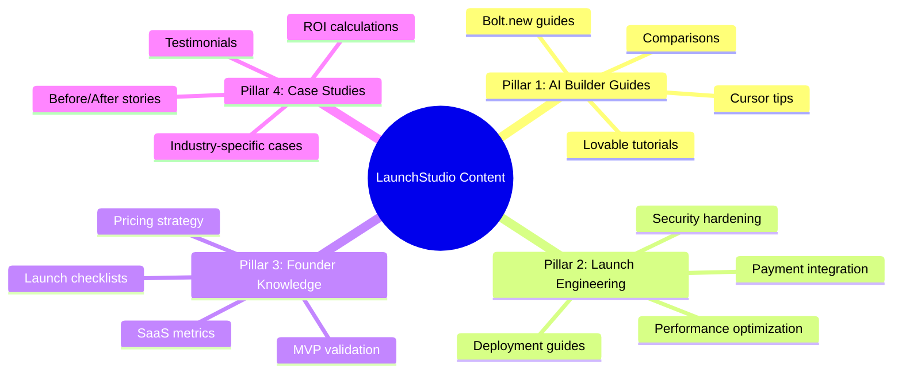

# 🚀 Kế Hoạch Marketing Tổng Thể — LaunchStudio

> **Mục tiêu:** Đưa LaunchStudio trở thành lựa chọn hàng đầu cho AI-native founders cần chuyển prototype sang production, thông qua chiến lược nội dung + SEO/GEO + paid + community trong 12 tháng.

---

## 1. Phân Tích Hiện Trạng

### 1.1 Sản Phẩm & Giá Trị Cốt Lõi

| Yếu tố                 | Chi tiết                                                                            |
| :----------------------- | :----------------------------------------------------------------------------------- |
| **Dịch vụ**      | Chuyển prototype (Lovable/Bolt/Cursor) thành sản phẩm launch-ready               |
| **Đối tượng**  | AI-native founders — non-technical hoặc semi-technical                             |
| **Giá**           | €800 – €7,500 (fixed price) + €49/tháng hosting                                 |
| **Thời gian**     | 1–3 tuần                                                                           |
| **USP chính**     | Giữ frontend hiện tại, chỉ fix backend/security/payments/hosting                 |
| **Backed by**      | Manifera — 11+ năm kinh nghiệm enterprise (Vodafone, TNO, CFLW)                   |
| **Gói dịch vụ** | *Launch Ready* (€800–€3,500) và *Launch & Grow* (€2,500–€7,500 + €49/mo) |

### 1.2 Tài Sản Content Hiện Có

| Tháng          | Số bài           | Ghi chú                                     |
| :-------------- | :----------------- | :------------------------------------------- |
| July 2026       | 60                 | Awareness-heavy, core topics                 |
| August 2026     | 60                 | Technical deep-dives                         |
| September 2026  | 60                 | 43 Awareness / 16 Consideration / 1 Decision |
| October 2026    | 60                 |                                              |
| November 2026   | 60                 |                                              |
| December 2026   | 60                 |                                              |
| January 2027    | 2                  |                                              |
| **Tổng** | **362 bài** | Markdown format, có Front Matter chuẩn     |

> [!IMPORTANT]
> LaunchStudio đã có **362 bài viết** sẵn sàng publish — đây là lợi thế cạnh tranh cực lớn về content. Phần lớn đang ở Awareness stage. Cần tăng tỷ lệ Consideration + Decision content lên để chuyển đổi.

### 1.3 Phân Bổ Buyer Stage Hiện Tại (Ước tính)

```
Awareness:     ~72%  ████████████████████░░░░░░░░
Consideration: ~25%  ██████████░░░░░░░░░░░░░░░░░
Decision:       ~3%  █░░░░░░░░░░░░░░░░░░░░░░░░░░
```

> [!WARNING]
> Tỷ lệ Decision content quá thấp (~3%). Cần bổ sung ngay các dạng: case study, pricing comparison, ROI calculator, "why LaunchStudio" content.

---

## 2. Phân Tích Thị Trường

### 2.1 Bối Cảnh Vibe Coding 2026

| Chỉ số                            | Giá trị                                                    |
| :---------------------------------- | :----------------------------------------------------------- |
| **Quy mô thị trường**     | ~$4.7 tỷ (2026), dự kiến $12.3 tỷ (2027)                 |
| **CAGR**                      | 38–42% đến 2030                                           |
| **Tỷ lệ dev dùng AI tool** | 92% dev Mỹ dùng hàng ngày                                |
| **Non-developer users**       | 63% người dùng vibe coding KHÔNG phải developer         |
| **Trust Gap**                 | Code AI tăng 180% nhưng chỉ ~30% đến được production |

> [!TIP]
> **Trust Gap = Cơ hội chính** cho LaunchStudio. 63% non-developers tạo ra prototype nhưng không biết cách production-ready → đây chính xác là khách hàng mục tiêu.

### 2.2 Đối Thủ & Vị Trí Cạnh Tranh

| Đối thủ                     | Loại        | Giá         | Điểm yếu                                |
| :----------------------------- | :----------- | :----------- | :----------------------------------------- |
| **Traditional agencies** | Full-rebuild | €20K–500K+ | Chậm (3–12 tháng), build lại từ đầu |
| **Freelancers**          | Variable     | €5K–20K    | Không hiểu AI codebases, inconsistent    |
| **Zite**                 | Platform     | Self-serve   | Không có human engineering, giới hạn   |
| **Lovable/Bolt/Replit**  | AI builders  | $20–50/mo   | Tạo prototype, không production-ready    |

**Vị trí của LaunchStudio:**

```
                    Low Price ◄─────────────────────► High Price
                         │
    AI Builders           │         Freelancers
    (Lovable, Bolt)       │     
                         │                    Traditional Agencies
    ─────────────────────┤────────────────────────────────
                         │
              ★ LaunchStudio ★
              (Sweet Spot)│
                         │
    Self-Service ◄───────┼────────► Full-Service
```

> LaunchStudio chiếm vị trí **"The Bridge"** — cầu nối giữa AI builders (prototype) và production. Đây là whitespace lớn nhất trên thị trường.

---

## 3. Chiến Lược Định Vị (Positioning)

### 3.1 Brand Positioning Statement

> **For AI-native founders** who built a prototype with Lovable, Bolt, or Cursor but aren't ready for real users yet, **LaunchStudio** is the launch engineering service that gets your app production-ready with security, payments, hosting, and deployment — **in weeks, not months, at a fraction of the cost** of traditional agencies.

### 3.2 Messaging Framework

| Audience Pain Point                   | LaunchStudio Message            | Proof Point                          |
| :------------------------------------ | :------------------------------ | :----------------------------------- |
| "My app looks great but isn't secure" | "We harden what you've built"   | Security checklist, RLS, env vars    |
| "I don't know how to deploy"          | "Live on your domain in days"   | Fixed timeline, zero-downtime deploy |
| "Agencies want to rebuild everything" | "We keep your frontend"         | Only fix backend, 80% cost savings   |
| "Freelancers don't get AI code"       | "We specialize in AI codebases" | Lovable/Bolt/Cursor expertise        |
| "I'm afraid of hidden costs"          | "Fixed price, always"           | Transparent pricing calculator       |

### 3.3 Taglines (A/B Test)

1. **"You built it with AI. We get it launch-ready."** ← hiện tại, rất tốt
2. "From prototype to production in 2 weeks."
3. "The last mile between your AI app and real users."
4. "Don't rebuild. Just launch."

---

## 4. Chiến Lược Kênh (Channel Strategy)

### 4.1 Owned Media — Content & SEO/GEO

#### A. Programmatic SEO (Existing 362 Articles)

**Mục tiêu:** Tối ưu và publish 362 bài viết hiện có theo lịch trình phù hợp.

**Lịch publish:**

| Giai đoạn | Tháng        | Số bài/tuần | Nội dung                            |
| :---------- | :------------ | :------------- | :----------------------------------- |
| Phase 1     | T7/2026       | 15/tuần       | Core awareness + brand authority     |
| Phase 2     | T8–T9/2026   | 15/tuần       | Technical deep-dives + consideration |
| Phase 3     | T10–T12/2026 | 15/tuần       | Scale + seasonal optimization        |
| Phase 4     | T1/2027+      | 5/tuần        | Maintenance + fresh content          |

**Content Pillars (Trụ cột nội dung):**



#### B. AI SEO / GEO Optimization

> [!IMPORTANT]
> **63% traffic tương lai sẽ đến từ AI search** (ChatGPT, Perplexity, Gemini). LaunchStudio cần tối ưu cho AI citation, không chỉ Google ranking.

**Chiến lược AI Citation:**

| Tactic                         | Mục tiêu                           | Ví dụ                                       |
| :----------------------------- | :----------------------------------- | :-------------------------------------------- |
| **Definition blocks**    | Được trích dẫn cho "What is..." | "What is an AI-native founder?"               |
| **Comparison tables**    | Được trích cho "X vs Y"          | "LaunchStudio vs traditional agency"          |
| **Statistics + Sources** | +40% visibility boost                | "92% of developers use AI tools daily (2026)" |
| **FAQ Schema**           | Hiện trong AI answers               | FAQ sections with structured data             |
| **Step-by-step guides**  | Được trích cho "How to..."       | "How to deploy Lovable app to production"     |

**Target AI Queries (20 queries ưu tiên):**

1. "how to make lovable app production ready"
2. "lovable vs bolt for SaaS MVP"
3. "deploy AI prototype to production"
4. "AI app security checklist"
5. "stripe integration for AI apps"
6. "is cursor good for building SaaS"
7. "how much does it cost to launch an AI app"
8. "row level security supabase explained"
9. "AI prototype to production service"
10. "best way to launch MVP built with AI"
11. "lovable app hosting options"
12. "bolt.new production deployment"
13. "cursor to production pipeline"
14. "AI generated code security risks"
15. "how to add payments to lovable app"
16. "vibe coding production ready"
17. "hire developer for AI prototype"
18. "launch AI SaaS product checklist"
19. "supabase RLS for beginners"
20. "AI app deployment service europe"

#### C. Content Gap — Cần Tạo Thêm

| Loại nội dung                                 | Số bài cần thêm | Buyer Stage   | Ưu tiên      |
| :---------------------------------------------- | :------------------ | :------------ | :------------- |
| **Case Studies chi tiết**                | 6–10 bài          | Decision      | 🔴 Cao         |
| **Pricing comparison pages**              | 3–5 bài           | Decision      | 🔴 Cao         |
| **ROI calculator content**                | 2–3 bài           | Decision      | 🔴 Cao         |
| **"Why LaunchStudio" pages**              | 3–5 bài           | Decision      | 🔴 Cao         |
| **Video testimonials**                    | 3–5 video          | Decision      | 🟡 Trung bình |
| **Integration guides (Lovable-specific)** | 10–15 bài         | Consideration | 🟡 Trung bình |
| **Industry landing pages**                | 5–8 pages          | Decision      | 🟡 Trung bình |

---

### 4.2 Paid Acquisition

#### A. Google Ads

**Budget gợi ý:** €1,500–3,000/tháng

| Chiến dịch            | Keywords                                       | Target           | CPA mục tiêu |
| :---------------------- | :--------------------------------------------- | :--------------- | :------------- |
| **Brand**         | "launchstudio", "launch studio"                | Warm leads       | €5–10        |
| **Competitor**    | "lovable production", "bolt deploy"            | AI builder users | €30–60       |
| **Problem-aware** | "deploy AI app", "production ready SaaS"       | Active searchers | €40–80       |
| **High intent**   | "hire dev AI prototype", "SaaS launch service" | Ready to buy     | €50–100      |

#### B. Meta/LinkedIn Ads

**Budget gợi ý:** €1,000–2,000/tháng

| Platform               | Format          | Targeting                        | Mục tiêu          |
| :--------------------- | :-------------- | :------------------------------- | :------------------ |
| **LinkedIn**     | Sponsored posts | Founders, Solo-entrepreneurs, EU | Lead gen            |
| **LinkedIn**     | Lead Gen Forms  | "Lovable", "Cursor" interest     | Checklist downloads |
| **Instagram/FB** | Reels / Stories | Startup communities              | Brand awareness     |
| **Twitter/X**    | Promoted tweets | AI / indie hacker audience       | Traffic + follows   |

#### C. Product Hunt Launch

> [!TIP]
> Product Hunt launch nên được lên kế hoạch cho **T8–T9/2026** — thời điểm content library đã được publish đủ để tạo momentum.

**Chuẩn bị:**

- Landing page riêng cho PH launch
- 3–5 testimonials từ early clients
- Video demo 60s
- Special launch pricing (e.g., 20% off first project)
- Warm-up community 2 tuần trước launch

---

### 4.3 Social Media & Community

#### A. Twitter/X Strategy (Primary Channel)

**Tần suất:** 5–7 posts/tuần

| Ngày | Loại nội dung          | Ví dụ                                                |
| :---- | :----------------------- | :----------------------------------------------------- |
| Mon   | 🧵 Thread giáo dục     | "7 security mistakes in Lovable apps"                  |
| Tue   | 📊 Before/After          | Screenshot prototype → production                     |
| Wed   | 💡 Quick tip             | "Always use RLS in Supabase"                           |
| Thu   | 📢 Blog promotion        | Link to new article                                    |
| Fri   | 🗣️ Founder story       | Client case study                                      |
| Sat   | 🔥 Hot take              | "AI builders are great. But they're not launch-ready." |
| Sun   | 📋 Checklist/Infographic | Launch readiness visual                                |

**Hashtags mục tiêu:** `#vibecoding` `#buildinpublic` `#indiehackers` `#lovable` `#cursorai` `#saas` `#launch`

#### B. Reddit & Community Presence

| Subreddit/Community | Chiến lược                   |
| :------------------ | :------------------------------ |
| r/SideProject       | Offer free launch audits        |
| r/SaaS              | Share expertise, link to guides |
| r/Lovable           | Help with production questions  |
| r/Cursor            | Technical advice                |
| r/Entrepreneur      | Share case studies              |
| Indie Hackers       | Build in public narrative       |
| Hacker News         | Technical deep-dives            |

#### C. LinkedIn (Secondary Channel)

**Tần suất:** 3 posts/tuần

- Founder-led content (CEO/founder personal brand)
- Client success stories
- "Behind the scenes" of launch engineering
- Industry insights about vibe coding

---

### 5. Partnership & Alliances

### 5.1 Quan Hệ Đối Tác Chiến Lược

| Partner Type                   | Partners                       | Cách hợp tác                      |
| :----------------------------- | :----------------------------- | :----------------------------------- |
| **AI Builder platforms** | Lovable, Bolt, Cursor          | Partner page, referral program       |
| **No-code communities**  | Buildcamp, Makerpad            | Workshop collabs, co-branded content |
| **Accelerators**         | Techstars, Y Combinator alumni | Launch engineering partner           |
| **Freelancer/Agency**    | White-label production partner | "Your branding, our engineering"     |
| **Hosting platforms**    | Vercel, Railway, Fly.io        | Co-marketing, integration guides     |

### 5.2 Referral Program

| Referrer         | Reward                              |
| :--------------- | :---------------------------------- |
| Past clients     | 10% off next project OR €150 cash  |
| Agency partners  | 15% commission on referred projects |
| Content creators | Co-branded case study + exposure    |

---

## 6. Conversion Rate Optimization (CRO)

### 6.1 Website Improvements

| Cải tiến                              | Impact                 | Effort      |
| :-------------------------------------- | :--------------------- | :---------- |
| Thêm live chat (Intercom/Crisp)        | Tăng lead capture 25% | Thấp       |
| Exit-intent popup với checklist        | Tăng email list 15%   | Thấp       |
| Social proof bar (logos + metrics)      | Tăng trust            | Thấp       |
| Video demo on hero section              | Giảm bounce rate 20%  | Trung bình |
| Blog section on main site               | Tăng organic traffic  | Trung bình |
| Multi-language landing pages (NL/DE/FR) | Expand EU market       | Cao         |

### 6.2 Sales Funnel Metrics (KPIs)


---

## 7. KPIs & Targets

### Theo Quý

| KPI                                 | Q3/2026 | Q4/2026 | Q1/2027 | Q2/2027 |
| :---------------------------------- | :------ | :------ | :------ | :------ |
| **Organic traffic** (monthly) | 5,000   | 15,000  | 30,000  | 50,000  |
| **Email subscribers**         | 500     | 2,000   | 5,000   | 10,000  |
| **Qualified leads/month**     | 20      | 50      | 100     | 200     |
| **Intro calls booked/month**  | 5       | 15      | 30      | 50      |
| **Projects closed/month**     | 2       | 5       | 10      | 15      |
| **MRR (Launch & Grow)**       | €200   | €1,000 | €3,000 | €7,000 |
| **AI citations** (monthly)    | 10      | 50      | 200     | 500     |
| **Domain Rating (Ahrefs)**    | 15      | 25      | 35      | 45      |

### Marketing Budget (Đề xuất)

| Hạng mục                    | Hàng tháng                | Ghi chú                  |
| :---------------------------- | :-------------------------- | :------------------------ |
| Google Ads                    | €1,500–3,000              | Scale theo ROI            |
| Social Ads (LinkedIn/Meta)    | €1,000–2,000              | Lead gen focus            |
| Tools (email, analytics, SEO) | €200–400                  | Mailchimp, Ahrefs, Hotjar |
| Content creation              | €500–1,000                | Freelance writers, video  |
| **Total**               | **€3,200–6,400/mo** |                           |

---

## 8. Lộ Trình Thực Hiện

### Phase 1: Foundation (T7/2026) — Xây nền

- [ ] Publish 60 bài July 2026 lên blog WordPress
- [ ] Setup Google Search Console + Analytics 4
- [ ] Cài đặt FAQ Schema trên trang chủ
- [ ] Thiết lập email marketing (Mailchimp/ConvertKit)
- [ ] Tạo email sequence cho checklist download
- [ ] Tạo 2–3 case studies chi tiết từ Marieke, Robin, Jasper
- [ ] Launch Twitter/X brand account với lịch post
- [ ] Setup Intercom/Crisp live chat
- [ ] Verify robots.txt cho phép GPTBot, PerplexityBot, ClaudeBot

### Phase 2: Growth (T8–T9/2026) — Tăng tốc

- [ ] Publish 120 bài (Aug + Sep 2026)
- [ ] Launch Google Ads campaigns
- [ ] Product Hunt launch preparation
- [ ] Tạo 5 bài Decision-stage content
- [ ] LinkedIn founder-led content campaign
- [ ] Partner outreach (Lovable, Bolt communities)
- [ ] A/B test homepage messaging
- [ ] Launch newsletter (bi-weekly)

### Phase 3: Scale (T10–T12/2026) — Mở rộng

- [ ] Publish 180 bài (Oct–Dec 2026)
- [ ] Product Hunt launch
- [ ] Multi-language expansion (NL content)
- [ ] Reddit AMA in r/SaaS or r/SideProject
- [ ] Industry-specific landing pages
- [ ] Referral program launch
- [ ] Retargeting ad campaigns
- [ ] Quarterly marketing report + optimization

### Phase 4: Optimize (Q1/2027+) — Tối ưu

- [ ] Content refresh strategy (update top-performing articles)
- [ ] Scale paid channels based on Q3/Q4 data
- [ ] Advanced AI SEO optimization
- [ ] Case study video series
- [ ] Evaluate expansion to DE/FR markets
- [ ] Community building (own Discord/Slack)

---

## 9. Open Questions

> [!IMPORTANT]
> **Cần phản hồi từ bạn trước khi triển khai:**

1. **Blog platform:** Blog hiện tại sử dụng WordPress? Hay cần publish qua headless CMS? Quy trình đăng bài hiện tại như thế nào?
2. **Budget thực tế:** Mức budget marketing hàng tháng bạn dự kiến là bao nhiêu? (Bản plan đề xuất €3,200–6,400/mo)
3. **Nhân sự marketing:** Hiện team có ai chuyên trách marketing không? Hay cần thuê freelancer/agency?
4. **Case studies:** Marieke, Robin, Jasper trong testimonials — có thể phát triển thành case study chi tiết không? Có thêm khách hàng nào khác?
5. **Product Hunt:** Bạn đã có tài khoản PH chưa? Có kế hoạch launch chưa?
6. **Email marketing:** Hiện đã có email list chưa? Đang dùng tool nào?
7. **Priority kênh:** Bạn muốn ưu tiên kênh nào trước: SEO content → Social → Paid, hay Paid → SEO → Social?
8. **White-label strategy:** Phần "Freelancer or agency? We also work as your silent production partner" — đây có phải là hướng kinh doanh muốn đẩy mạnh không?
9. **NL vs EN priority:** Phiên bản NL (Dutch) có phải là thị trường chính không? Hay EN cho global market?
10. **Existing analytics:** Có data traffic/conversion hiện tại để làm baseline không?
